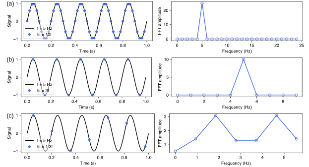
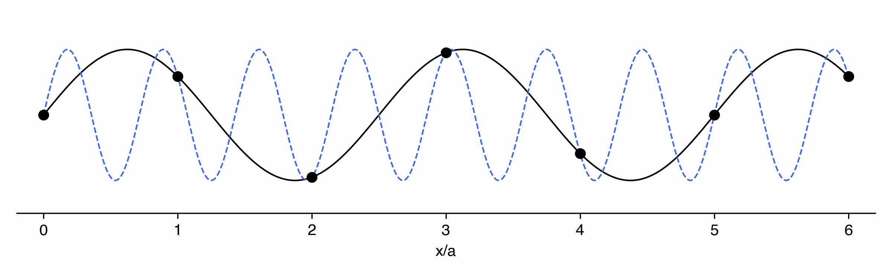
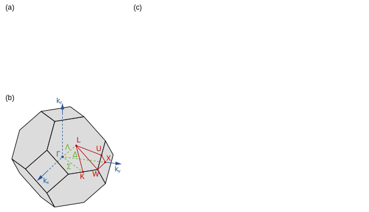

Author: **Ang Chen** | Email: chenang@outlook.com | Date: 07-30-2023 | Online monthly meeting @BIT

# Contents
- [Contents](#contents)
- [Energy bands](#energy-bands)
  - [Hydrogen atom](#hydrogen-atom)
  - [Periodic potential](#periodic-potential)
    - [Nyquist–Shannon sampling theorem](#nyquist–shannon-sampling-theorem)
    - [Brillouin Zone](#brillouin-zone)
  - [Silicon](#silicon)
  - [Graphene](#graphene)
- [References](#references)

# Energy bands 

Energy bands of a solid describe the range of energy levels that electrons may have within it, as well as the ranges of energy that they may not have (called band gaps or forbidden bands) [1].
To derive those bands and band gaps, we need solve the Shr&ouml;dinger equation:

$$\tag{1}
i\hbar\frac{\partial}{\partial t}\Psi(\textbf{r}, t) =
-\frac{\hbar}{2m} \nabla^2 \Psi(\textbf{r}, t) + V(\textbf{r}, t)\Psi(\textbf{r}, t),
$$

where $\Psi(\textbf{r}, t)$ is the wave function of the electron, $V(\textbf{r}, t)$ is the potential energy of the electron, and $m$ is the mass of the electron.

For energy bands calculations, we only consider the case that the potential $V$ is *independent of $t$*. Then with the separation of variables $\Psi(\textbf{r}, t) = \psi(\textbf{r})f(t)$ and some algebra, we can get $\Psi(\textbf{r}, t) = \psi(\textbf{r})e^{-iEt/\hbar}$ with $E$ the state energy and the time-independent Shr&ouml;dinger equation:

$$\tag{2}
-\frac{\hbar}{2m} \nabla^2\psi(\textbf{r}) + V(\textbf{r})\psi(\textbf{r}) = E \psi(\textbf{r}).
$$

We can go no further with it until the potential $V(\textbf{r})$ is specified. Next consider the following three cases:

- Hydrogen atom: solved in an exact closed form, with Coulomb potential $V(\textbf{r}) = -\frac{e^2}{4\pi\epsilon_0}\frac{1}{r}$.
- Silicon: the most important semiconductor, with 3D periodic potential $V(\textbf{r}) = V(\textbf{r}+\textbf{R})$.
- Graphene: the most important 2D material, with 2D periodic potential $V\left(\textbf{r}_\parallel\right) = V\left(\textbf{r}_\parallel+\textbf{R}_\parallel\right)$.

## Hydrogen atom

For an hydrogen atom, the potential is $V(\textbf{r}) = -\frac{e^2}{4\pi\epsilon_0}\frac{1}{r}$, which is a function only of $r$. In that case, it's natural to adopt spherical coordinates $(r, \theta, \phi)$, and the Laplacian operator takes the form:

$$\tag{3}
\nabla^2 = \frac{1}{r^2}\frac{\partial}{\partial r}\left(r^2\frac{\partial}{\partial r}\right) + \frac{1}{r^2\sin\theta}\frac{\partial}{\partial \theta}\left(\sin\theta\frac{\partial}{\partial \theta}\right) + \frac{1}{r^2\sin^2\theta}\frac{\partial^2}{\partial \phi^2}.
$$

And we can separate the variables $\psi(r, \theta, \phi) = R(r)Y(\theta, \phi)$, resulting in two equations:

$$
\tag{4a} \frac{1}{R}\frac{d}{dr}\left(r^2\frac{dR}{dr}\right) + \frac{2mr^2}{\hbar^2}\left[\frac{e^2}{4\pi\epsilon_0}\frac{1}{r} + E\right] = l(l+1),
$$
and
$$
\tag{4b} \frac{1}{Y}\left[\frac{1}{\sin\theta}\frac{\partial}{\partial \theta}\left(\sin\theta\frac{\partial Y}{\partial \theta}\right) + \frac{1}{\sin^2\theta}\frac{\partial^2 Y}{\partial \phi^2}\right] = -l(l+1).
$$

Solving Eqs. (4a) and (4b) leads to the hydrogen wave functions (see detail in [2,3]) with allowed energies

$$\tag{5}
E_n = -\left[\frac{m}{2\hbar^2}\left(\frac{e^2}{4\pi\epsilon_0}\right)^2\right]\frac{1}{n^2}, \quad n=1,2,3,\ldots.
$$

## Periodic potential

In the solid state, a few of the loosely bound outermost valence electrons in each atom become detached and roam around throughout the material, no longer subject only to the Coulomb field of a specific "parent" nucleus, but rather to the combined potential of the entire crystal lattice. For an isolated atom, like the hydrogent atom, electron's allowed energy states are discrete, dubbed as "energy levels". When lots of atoms forming solid, because of the Pauli exclusion principle, only two electrons can occupy a given spatial state. As a results, the discrete energy levels are expanded into energy bands, separated by forbidden gaps.

Now, if a band is entirely filled, it takes a relatively large energy to excite an electron, since it has to jump across the forbidden zone. Such materials will be electrical **insulators**. On the other hand, if a band is only partly filled, it takes very little energy to excite an electron, and such materials are typically **conductors**. If you dope an insulator with a few atoms of larger or smaller charges, this puts some "extra" electrons into the next higher band, or creates some holes in the previously filled one, allowing in either case for weak electric currents to flow; such materials are called **semiconductors**.

Band structure is the *signature* of a periodic potential. Next, we have the Bloch's theory, which introduces a *periodic* potential representing the electrical attraction of the regularly spaced, positively charged, nuclei (still ignoring electron-electron
repulsion): $V(\textbf{r}) = V(\textbf{r}+\textbf{R})$, giving the Bloch function as the solution to Eq. (2):

$$\tag{6}
\psi_\textbf{k}(\textbf{r}) = e^{i\textbf{k}\cdot\textbf{r}} u(\textbf{r}); \quad u(\textbf{r}+\textbf{R}) = u(\textbf{r}).
$$

Here $\textbf{k}$ is crystal momentum vector. To fully understand energy bands, $\textbf{k}$ is the key point but also confusing. We digress somewhat to the famous theorem in informatics: Nyquist–Shannon sampling theorem.

### Nyquist–Shannon sampling theorem

<!--  -->

Here is one expression of the Nyquist-Shannon sampling theorem [1] to enhance everyone's understanding of the theorem:

**Theorem** — *If a function $x(t)$ contains no frequencies higher than $B$ hertz, then it can be completely determined from its ordinates at a sequence of points spaced less than $1/(2B)$ seconds apart.* 

Needless to say what. Figure 1 shows what the theorem tells. Left panel plots the original signal $y(t)$, which is a sinusoidal time series with frequency $f=5$ Hz, and the sampled signal $y_s(t)$ with different sampling rates. Right panel plots their corresponding FFT spectra. We can see that when the sampling rate $f_s$ is larger than twice the signal frequency $f$, the original signal can be completely determined from its sampled signal. Otherwise, the original signal cannot be recovered, with a phenomenon called *frequency aliasing*.

### Brillouin Zone

Brillouin Zone (BZ) resides in reciprocal space and almost all the textbooks tell us that the first BZ matters above all. Let's see through it from Nyquist–Shannon sampling theorem. To simplify, we consider the Bloch wave of an electron in one dimension, and sampling happens in the space domain instead of time domain. Thus the sampling rate is decided by the lattice period: $k_s = 2\pi/a$, leading to the important relation for first BZ:
$$\tag{7}
k_s\ge2|k| \longrightarrow -\pi/a\le k\le\pi/a.
$$ 

<!--  -->

## Silicon

There are two basic methods for computing structures and properties of solids: 

- The "ab initio" ("first principles").
- The "(semi) empirical" methods. 

The former do not include any empirically or experimentally derived quantities whereas the latter do.
For calculating silicon energy bands, we adopt tight-binding (TB) method as an example of the latter. TB method is a semi-empirical method, whose basic idea of the tight-binding method is, that one writes the eigenstates of the Hamiltonian in an atomic-like basis set. Then one replaces the exact many-body Hamilton operator with a parameterized Hamilton matrix. For this reason, one commonly does not calculate the explicit form of the basis set. "Atomic-like" means that it has the same symmetry properties as the atomic orbitals.

### Deriving the tight-binding model

## Graphene

# References

1. [https://www.wikipedia.org](https://www.wikipedia.org)
2. David J. Griffiths. *Introduction to Quantum Mechnics, Chap. 4*. Prentice Hall, NJ, 1995.
3. David Tong. [*Lectures on Quantum Mechanics, Chap. 4*.](http://www.damtp.cam.ac.uk/user/tong/qft.html)
4. David Tong. [*Lectures on Solid State Physics, Chap. 2*.](https://www.damtp.cam.ac.uk/user/tong/solidstate.html)
